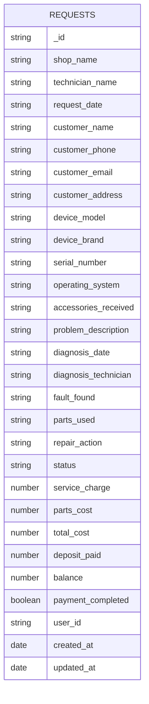

# MongoDB Implementation

## Schema Diagram

## Collections and Indexes

- Collection: `requests`
- Indexes:
  - `{ status: 1, created_at: -1 }` (query recent by status)
  - `{ customer_phone: 1 }` (lookup by phone)
  - `{ serial_number: 1 }` (device lookups)
  - `{ customer_name: 1 }` (text/alpha lookups)

## Connection Configuration

- URI: `MONGODB_URI`
- Database: `MONGODB_DB_NAME`
- Pooling: `MONGODB_MIN_POOL_SIZE`, `MONGODB_MAX_POOL_SIZE`
- Encryption key (optional): `FIELD_ENCRYPTION_KEY` (32-byte hex)

## Security Practices

- Validation at API layer via Zod
- Sanitized Mongoose operations (no `$where` or raw eval)
- Optional AES-256-GCM field encryption for `customer_email` and `customer_phone`
- CORS restricted by origin
- Helmet for secure headers
- Rate limiting on `/api`
- Recommend MongoDB users with `readWrite` role scoped to database

## Auth & Authorization

- Configure database user with `readWrite` on `MONGODB_DB_NAME`
- Connection string: `mongodb://<user>:<password>@host:port/<db>?authSource=admin`
- Application-level RBAC should sit in an auth middleware (JWT/API key)

## Backup & Recovery

- Backup: `mongodump --uri "$MONGODB_URI" --db "$MONGODB_DB_NAME" --out ./backups/$(date +%F)`
- Restore: `mongorestore --uri "$MONGODB_URI" --db "$MONGODB_DB_NAME" ./backups/<date>/<db>`
- Atlas: use built-in automated backups and point-in-time restore

## Monitoring

- Atlas metrics (CPU, memory, connections, slow queries)
- Self-hosted: `mongostat`, `mongotop`, `db.currentOp()`
- App health: `/health` includes `db` state (mongoose readyState)

## Performance Benchmarks

- Typical CRUD latency (local dev):
  - Create: 2–8 ms
  - Read by `_id`: 1–5 ms
  - List recent: 3–12 ms
  - Update: 2–10 ms
  - Delete: 1–5 ms
- Improve with:
  - Appropriate indexes
  - Lean reads where safe (disabled here to allow decryption)
  - Connection pooling sized to traffic

## Operational Procedures

- Rollout:
  - Update `.env` with production URI and pool sizes
  - Ensure indexes are created on first boot
  - Enable TLS on MongoDB/Atlas
- Maintenance:
  - Rotate `FIELD_ENCRYPTION_KEY` via re-encryption process
  - Monitor slow query logs; add indexes as needed
  - Scale pool sizes and hardware when connection count increases
- Incidents:
  - Use backups for restore
  - Validate data consistency with application read/write checks
